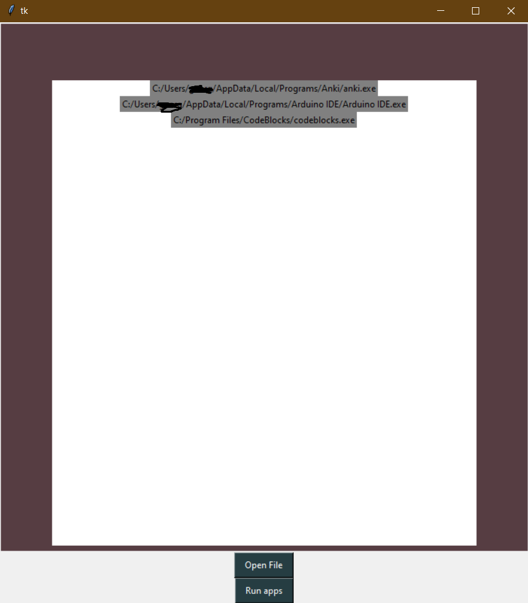

# AppOpen
Simple app opener to organize all your apps.

## Installing

To get started, follow these steps:

1. Clone the repository:

    ```bash
    git clone https://github.com/arcademiss/AppOpen.git

2. Navigate to the project directory:

    ```bash
    cd AppOpen
    ```

3. Create and activate a virtual environment (optional but recommended):

    ```bash
    python -m venv venv
    source venv/bin/activate  # On Unix or MacOS
    venv\Scripts\activate     # On Windows
    ```

4. Install project dependencies:

    ```bash
    pip install -r requirements.txt
    ```

## Play

Starting the game is simple. Follow these steps:

1. Run the application:

    ```bash
    python app.py
    ```

    This will launch the app.

2. Press Open file and choose the executables you want the program to run.

3. Now that you have selected your apps, you may run them.

4. If you wish to delete the list of apps and start another one you need to delete the 'save.txt' file.

## Screenshot



### Note

This is a for fun project, treat it as it is.
